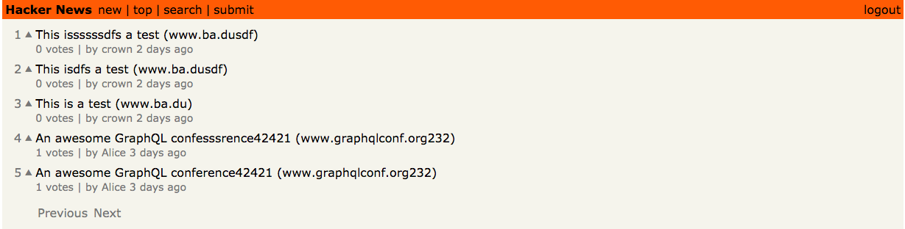

# A Hackernews Demo Server Using TS, Node, GraphQL

[](https://dev.azure.com/crown0938/Github/_build/latest?definitionId=10&branchName=master)

The series of projects implements a simple `Hackernews Demo`,including server
and client, mainlyfor individuals to familiarize themselves with the development
environment and ecology of `GraphQL`. The functions implemented include user
registration and login, feed, feed voting, and the pagination of feed , etc. The
main code refers to the relevant implementation of the
[HowToGraphQL](https://www.howtographql.com) project, the series of projects is
mainly divided into the follwing parts:

- Hackernews Demo
  - Server
    - [`Node`](https://github.com/crown3/GraqhQL-Server-Node-TS): implement with `graphql-yoga`, `prisma`, `ts`
  - Client
    - [`React`](https://github.com/crown3/GraphQL-Client-React-TS): implement with `react-apollo`, `react`, `ts`



## Getting Started

**NOte:** there is only an introduction to how the server code run. If you want
to see the entire project, you need to go to another repository to install the
relevant client code, such as [the Web using React](https://github.com/crown3/GraphQL-Client-React-TS)

### Prerequisites

You only need to provide the `Node`'s running environment, there is mine:

```bash
❯❯❯ node -v
v10.15.0
```

### Installing

Install the dependencies, open the browser URL of the prompt, such as `http://localhost:4000`:

```bash
yarn install
yarn dev
```

The introduction of other scripts:

```json
{
  "scripts": {
    "cz": "git-cz", // Standardize your commit message, please use `yarn cz` instead of `git commit ...` after `git add`
    "lint": "eslint --ext .ts,.tsx src", // lint your code
    "dev": "ts-node src/index.ts",
    "dev:watch": "nodemon --watch 'src/**/*.ts' --ignore 'src/**/*.spec.ts' --exec yarn dev", // run dev with watching mode
    "prisma:deploy": "export NO_PROXY=*; prisma deploy", // deploy prisma config to your database
    "prisma:generate": "prisma generate" // generate some typescript code which based on your datamodel.prisma
  }
}
```

**Note:** the relevant code in the `src/generated` folder is automatically
generated, don't modify. `src/genereted/prisma-client` is generated according to
the relevant configuration in your `prisma`. After modifying the related files
in `prisma`, remember to run `yarn prisma:deploy`. By default, a cloud node for
testing s provided, `https://us1.prisma.sh/crown-a144e9/demo-hackernews/dev`

## Running the tests

There are currently no related test files...

## Contributing

Please read [CONTRIBUTING.md](./.github/CONTRIBUTING.md) for details on our code
of conduct, and the process for submitting pull requests to.

## Versioning

We use [semantic-release](https://github.com/semantic-release/semantic-release#readme) for versioning. For the versions available, see the [tags on this repository](https://github.com/crown3/GraqhQL-Server-Node-TS/tags).

## Authors

- **Crown Chen** - [Crown](https://github.com/crown3)

See also the list of [contributors](https://github.com/crown3/GraqhQL-Server-Node-TS/contributors) who participated in this project.

## License

This project is licensed under the MIT License - see the [LICENSE.md](./LICENSE) file for details

## Acknowledgments

- Again, this is just a `Demo Project`
