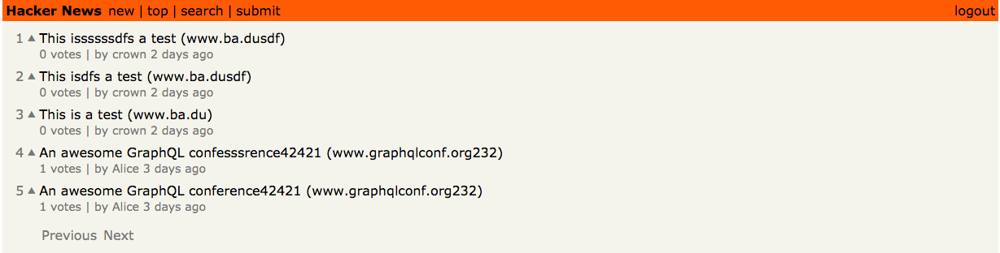

# A Hackernews Demo Server Using TS, Node, GraphQL

[](https://dev.azure.com/crown0938/Github/_build/latest?definitionId=5&branchName=master)

[English](./README.md) | [中文](./README.zh-CN.md)

该系列项目实现了一个简易的`Hackernews Demo`，包括服务端与客户端，主要是个人用来熟悉 `GraphQL` 相关开发环境与生态的练手项目，实现的功能包括`用户注册以及登陆`、`Feed`、`Feed的投票`、`Feed的分页`，`Feed及其投票的更新订阅`等，其中主要代码参考了 [HowToGraphQL](https://www.howtographql.com/) 这个项目中的相关实现，项目主要分为以下几个部分：

- Hackernews Demo
  - Server
    - [`Node`](https://github.com/crown3/GraphQL-Server-Node-TS): implement with `graphql-yoga`, `prisma`, `ts`，`Docker`
  - Client
    - [`React`](https://github.com/crown3/GraphQL-Client-React-TS): implement with `react-apollo`, `react`, `ts`



## 如何开始

注意，这里只有关于服务端代码如何运行的介绍，如果你要查看完整的整个项目，你还需要去到另外的仓库中安装相关的客户端代码，例如[`Web using react`](https://github.com/crown3/GraphQL-Client-React-TS)

### 运行环境

你只需要提供`Node`和`Docker`的运行环境即可，我的`Node`和`Docker`版本：

```bash
❯❯❯ node -v
v10.15.0
❯❯❯ docker -v
Docker version 18.09.2, build 6247962
```

### 安装

安装相关依赖

```bash
yarn install
```

发布你的 `Prisma API` 到本地运行的 `Docker` 服务中去

```bash
docker-compose up -d
yarn prisma deploy
```

<details>
 <summary><strong>我的电脑上没有安装 Docker</strong></summary>

这时你可以去使用 `Prisma` 提供的线上测试服务器，而不是使用本地的服务，按以下步骤设置即可：

- 运行下面命令：
  ```
  yarn prisma deploy --new
  ```
- 在下面的 CLI 提示中:
  - 选择 **Demo server**
  - 在接下来的问题中，全部回车选择默认选项即可

</details>

运行服务，打开提示的浏览器网址，例如`http://localhost:4000`：

```bash
yarn dev
```

### 其它运行脚本介绍

```jsonc
{
  "scripts": {
    "cz": "git-cz", // Standardize your commit message, please use `yarn cz` instead of `git commit ...` after `git add`
    "lint": "eslint --ext .ts,.tsx src", // lint your code
    "dev": "ts-node src/index.ts",
    "dev:watch": "nodemon --watch 'src/**/*.ts' --ignore 'src/**/*.spec.ts' --exec yarn dev", // run dev with watching mode
    "prisma": "cd prisma && prisma generate", // Run the `prisma` related command in the `prisma` folder
    "generate-resolvers": "graphql-resolver-codegen interfaces -s src/schema.graphql -o src/generated/resolvers.ts" // Generate corresponding `resolvers.ts` based on your graphql configuration file, avoid the need to manually declare various interface configuration
  }
}
```

注意：`src/generated`这个文件夹里面的相关代码全是自动生成的，不要修改，其中`src/generated/prisma-client`是根据你的 `prisma`里的相关配置来生成，在修改了 `prisma` 中的相关文件后，记得运行`yarn prisma deploy`。

## 运行测试

目前还没有相关测试文件...

## Contributing

Please read [CONTRIBUTING.md](./.github/CONTRIBUTING.md) for details on our code of conduct, and the process for submitting pull requests to us.

## Versioning

We use [semantic-release](https://github.com/semantic-release/semantic-release#readme) for versioning. For the versions available, see the [tags on this repository](https://github.com/crown3/GraphQL-Server-Node-TS/tags).

## Authors

- **Crown Chen** - [Crown](https://github.com/crown3)

See also the list of [contributors](https://github.com/crown3/GraphQL-Server-Node-TS/contributors) who participated in this project.

## License

This project is licensed under the MIT License - see the [LICENSE](./LICENSE) file for details

## Acknowledgments

- 再次声明，这只是一个`Demo Project`
